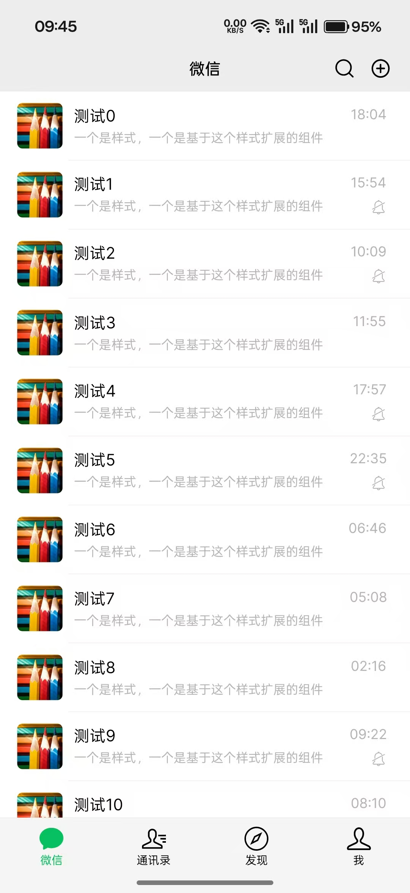
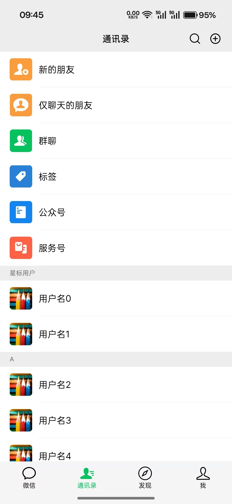
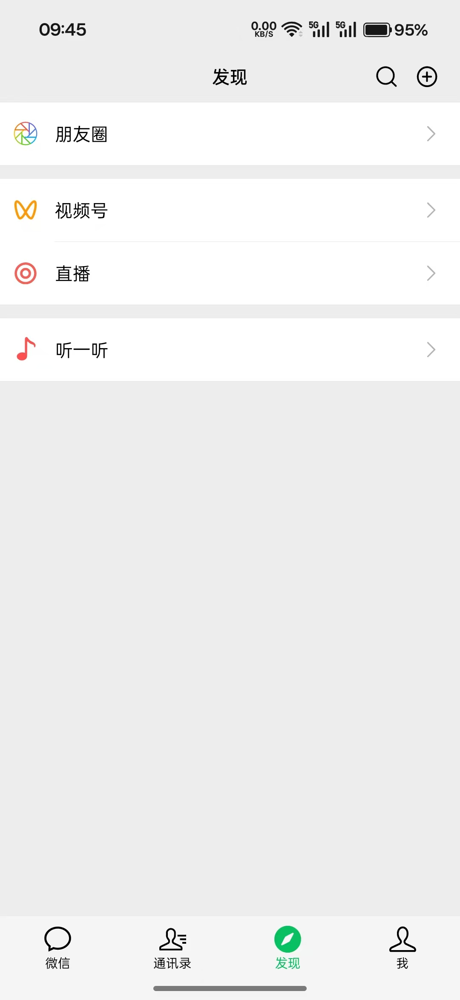
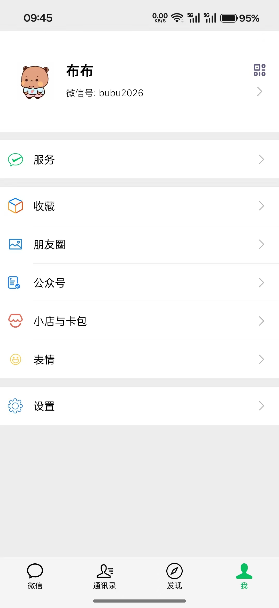

# WeChatBlazonia

使用[Blazonia](https://github.com/Blazonia/Blazonia) (Avalonia的Blazor绑定)  模仿微信的界面，验证Blazonia的功能完善程度

Use Blazonia (the Blazor binding for Avalonia) to mimic the WeChat interface and verify the completeness of Blazonia's functionality.

